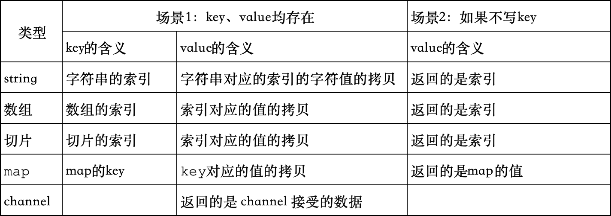

## 1.说明
go语言中只提供了一种循环方式，即for循环。
## 2.for语法
```properties
for init; condition; post {
    代码
}
```
## 3.for range语法
等价于java中的for each。主要是对字符串、数组、切片、map、channel的遍历。
```properties
for key, value := range 变量 {
   代码
}
```
对于不同的变量类型，key和value分别代表了什么？<br/>

## 4.for循环的退出
- continue：跳过本次循环
- break：跳出整个循环

## 5.goto语句
goto语句可以让我们的代码跳到指定的代码中运行。其使得代码可读性降低，所以说很少用。<br/>
使用场景, 最多的是程序的错误处理。<br/>
```go
package main
import "fmt"

func gotoDemo() {
	// goto语句的示例， 在嵌套循环中，如何跳出整个循环
	for i := 0; i < 3; i++ {
		for j := 0; j < 3; j++ {
			if j == 1 { // 期望是打印 0 0。 实际使用break无法跳过外循环，会打印0 0/ 1 0 / 2 0
				//break // 仅会跳出j代表的整个循环，而无法跳出外循环，此时就需要使用到goto循环了
				goto over
			}
			fmt.Println(i, j)
		}
	}

	// 定义goto语句块
over:
	fmt.Println("over")  
}
```